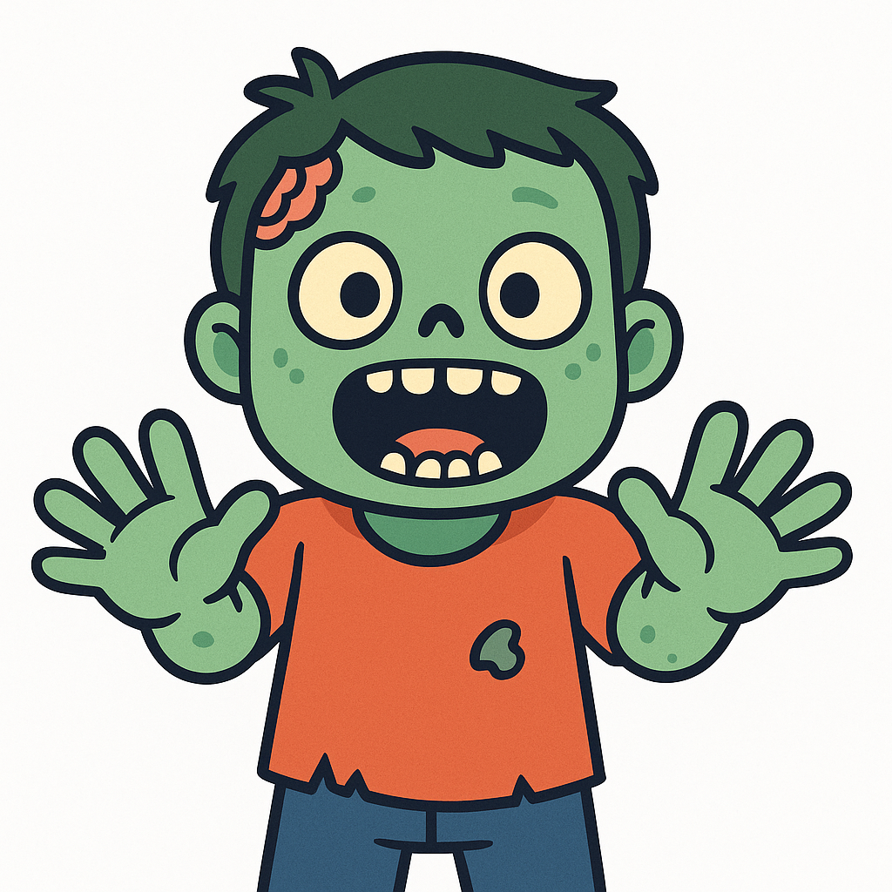

# zombie


A React Native module for persistent background location tracking that keeps working even after the app is killed.

## Installation

```sh
npm install react-native-zombie-gps
# or
yarn add react-native-zombie-gps
```

## Usage

```ts
import {
  addListener,
  startMonitoring,
  stopMonitoring,
} from 'react-native-zombie-gps';

async function bootstrapZombieGps() {
  addListener((location) => {
    console.log(
      `lat=${location.latitude}, lng=${location.longitude} @ ${location.timestamp}`
    );
  });

  startMonitoring();

  return () => {
    // subscription.remove?.();
    // stopMonitoring();
  };
}
```

See `example/src/App.tsx` for a UI example that renders the active coordinates.


## Development

```sh
yarn lint          # eslint
yarn format        # prettier --check
yarn format:write  # prettier --write
yarn pre-push      # lint + format (ideal for git hooks)
```

## Contributing

- [Development workflow](CONTRIBUTING.md#development-workflow)
- [Sending a pull request](CONTRIBUTING.md#sending-a-pull-request)
- [Code of conduct](CODE_OF_CONDUCT.md)

## License

MIT
